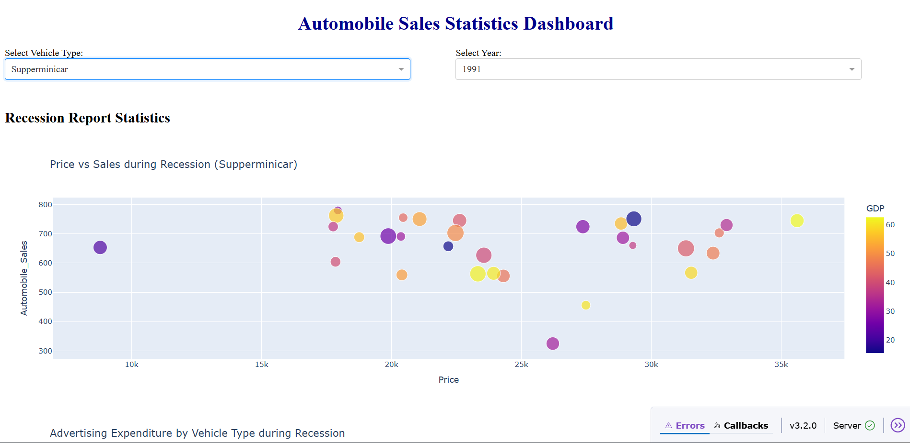

# Automobile Sales Statistics Dashboard




## Project Overview
This project is a **Dash-based interactive dashboard** that visualizes historical automobile sales data. The dashboard allows users to analyze sales trends, GDP, unemployment rates, advertising expenditure, and seasonal effects on different vehicle types during recession and non-recession periods.

The project leverages **Pandas, Matplotlib, Seaborn, and Plotly** for data analysis and visualization.

---

## Features

### Data Analysis Visualizations:
- **Line Plots**: Shows how automobile sales fluctuate year-to-year.
- **Vehicle Type Trends**: Multiple line plots comparing sales trends across vehicle categories.
- **Bar Charts**: Compare sales trends during recession and non-recession periods using Seaborn.
- **GDP Subplots**: Line plots comparing GDP variations during recession vs non-recession periods.
- **Bubble Plots**: Illustrate the impact of seasonality on automobile sales.
- **Scatter Plots**: Identify correlations between average vehicle price and sales volume during recessions.
- **Pie Charts**: Display advertising expenditure distribution by period and by vehicle type.
- **Unemployment Analysis**: Line plots showing the effect of unemployment rates on vehicle sales.

### Interactive Dashboard (Dash):
- Dropdowns to select **vehicle type** and **year**.
- Dynamic updates based on user selections.
- Organized layout with output container displaying selected statistics.

---

## Dataset
The project uses the **Historical Automobile Sales dataset** from IBM Developer Skills Network:

[Dataset URL](https://cf-courses-data.s3.us.cloud-object-storage.appdomain.cloud/IBMDeveloperSkillsNetwork-DV0101EN-SkillsNetwork/Data%20Files/historical_automobile_sales.csv)

**Columns include:**
- Date, Year, Month, Recession, Consumer_Confidence, Seasonality_Weight
- Price, Advertising_Expenditure, Competition, GDP, Growth_Rate, unemployment_rate
- Automobile_Sales, Vehicle_Type, City

---

## Installation

1. Clone the repository:
```bash
git clone <repository-url>
cd <project-folder>

2. Create a virtual environment:
python -m venv venv
source venv/bin/activate   # Linux/Mac
venv\Scripts\activate      # Windows

3. Install dependencies:
pip install -r requirements.txt

Running the Dashboard Locally
python app.py

